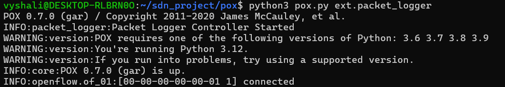
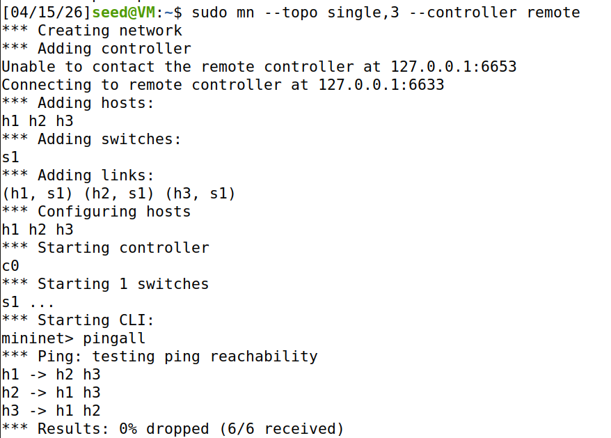
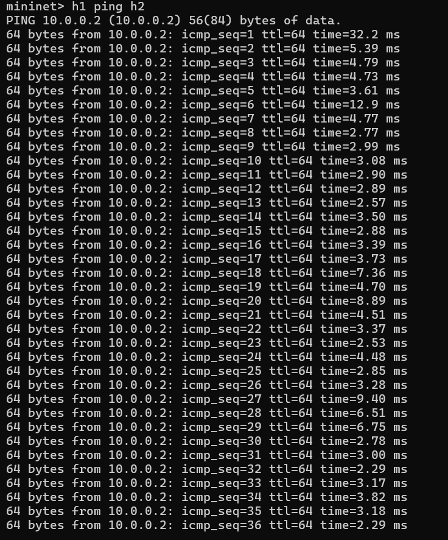
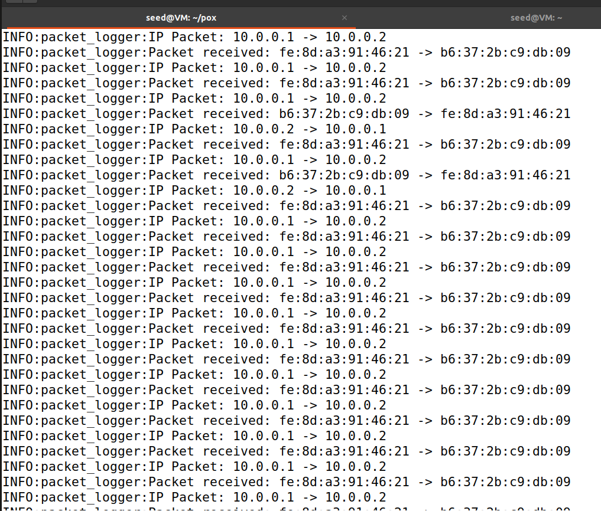
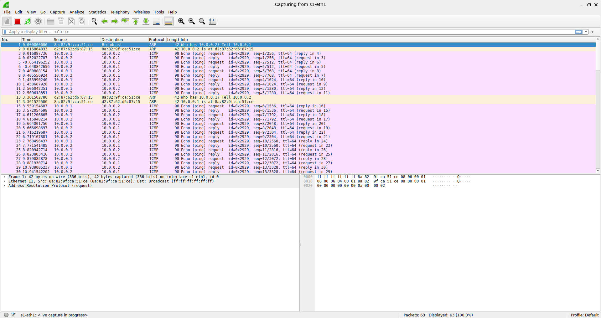
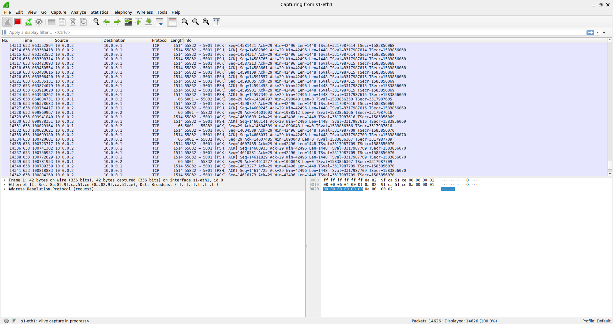
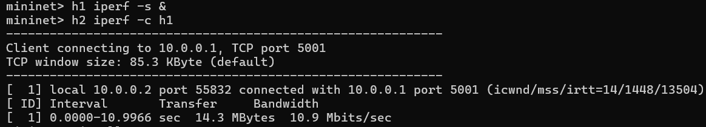
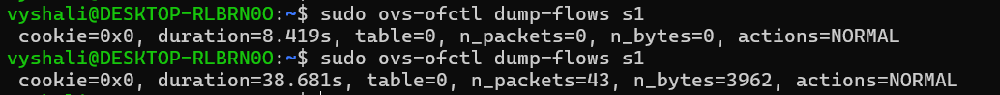

# SDN Packet Logger using POX and Mininet

## Project Description
This project implements a Software Defined Networking (SDN) packet monitoring system using a POX controller and Mininet. The controller captures PacketIn events from the OpenFlow switch, logs packet information, and applies basic OpenFlow match–action rules.

Network traffic is generated using ping and iperf, and packets are analyzed using Wireshark.

## Problem Statement
Design and implement an SDN-based packet monitoring system using Mininet and an OpenFlow controller (POX). The controller should capture packets, log relevant information, and demonstrate controller–switch interaction through match–action flow rules.

## Technologies Used
- Mininet
- POX SDN Controller
- Open vSwitch
- Wireshark
- iperf
- Python

## Setup and Execution Steps

### 1. Start the POX Controller

cd ~/sdn_project/pox
python3 pox.py ext.packet_logger

### 2. Start Mininet

sudo mn -c
sudo mn --topo single,3 --controller remote

### 3. Test Connectivity

pingall

### 4. Generate ICMP Traffic

h1 ping h2

### 5. Generate TCP Traffic

h1 iperf -s &
h2 iperf -c h1

### 6. View Flow Table

sudo ovs-ofctl dump-flows s1

### 7. Capture Packets
Run Wireshark and capture packets on interface:

s1-eth1

## Expected Output

- Successful host communication (0% packet loss in ping test)
- Packet logs displayed in the controller terminal
- ICMP and TCP packets visible in Wireshark
- Throughput displayed using iperf
- Flow table entries visible in the switch

## Proof of Execution

### Controller Running

### Mininet Topology

### ICMP Ping Test

### Controller Packet Logs

### Wireshark ICMP Capture

### Wireshark TCP Capture

### TCP Performance Test (iperf)

### Flow Table

